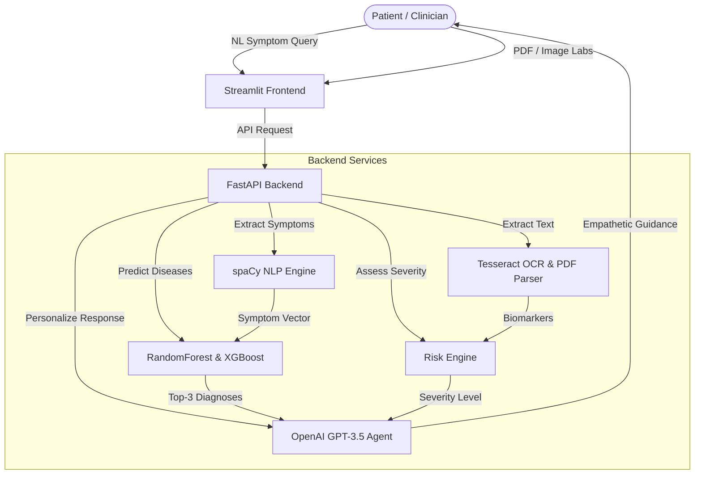

# Aegis AI: Personalized Treatment Recommendation Agent

Aegis AI is an autonomous healthcare assistant and clinical decision support system. It leverages Natural Language Processing (NLP) for symptom extraction, Machine Learning (XGBoost/RandomForest) for disease prediction, Tesseract OCR for parsing laboratory reports, and Generative AI (OpenAI) for formulating explanation-driven guidance.



---

## 🚀 Key Features

1. **Natural Language Symptom Extraction:** Lemmatizes and parses layperson symptoms using a custom spaCy-powered synonym mapping.
2. **Double-Engine Classification:** Predicts the top-3 most probable diseases with associated confidence scores using a baseline RandomForest and an optimized XGBoost classifier.
3. **Medical Report OCR:** Uses `pytesseract` and `pdfplumber` to extract biomarkers (Glucose, Hemoglobin, Cholesterol) from lab reports.
4. **Clinical Risk Engine:** Assesses severity into *Low*, *Medium*, or *High* based on symptom urgency, predicted disease danger, and out-of-range lab markers.
5. **Generative Clinical Chatbot:** Connects to OpenAI to generate conversational, personalized explanations, falling back to a structured local rule-based system if an API key is not present.
6. **Analytics Dashboard:** Visualizes interactive diagnostic statistics and compares ML model metrics.
7. **Comprehensive Integration Tests:** Fully verified using unit and endpoint test suites.

---

## 🛠️ Technology Stack

- **Frontend:** Streamlit
- **Backend:** FastAPI, Uvicorn
- **Machine Learning:** XGBoost, Scikit-Learn
- **NLP:** spaCy (`en_core_web_sm`)
- **OCR:** Pytesseract (Tesseract OCR)
- **PDF Extraction:** PDFPlumber, PyPDF2
- **Testing:** Pytest

---

## 📦 How to Run Locally

### 1. Prerequisite Setup
Make sure you have python 3.11+ and Tesseract OCR installed on your system.

### 2. Setup Virtual Environment & Install Dependencies
```powershell
python -m venv .venv
.venv\Scripts\activate
pip install -r requirements.txt
python -m spacy download en_core_web_sm
```

### 3. Preprocess Data & Train Models
```powershell
# Run the ML training pipeline
python -m src.ml_engine
```

### 4. Run Test Suite
```powershell
python -m pytest
```

### 5. Launch Application
In separate terminal sessions, execute:
```powershell
# Start FastAPI backend API
.venv\Scripts\python.exe -m uvicorn src.main:app --host 0.0.0.0 --port 8000

# Start Streamlit frontend portal
.venv\Scripts\streamlit.exe run app.py --server.port 8501 --server.headless true
```

---

## 🐳 Docker Deployment

To launch the complete application stack (frontend + backend decoupled services) using Docker:

```bash
docker-compose up --build
```
- FastAPI Backend will run at: `http://localhost:8000`
- Streamlit Portal will run at: `http://localhost:8501`

---

### *Disclaimer*
*Aegis AI is built for educational and clinical decision support purposes. It does not replace professional medical diagnosis, advice, or treatment.*
